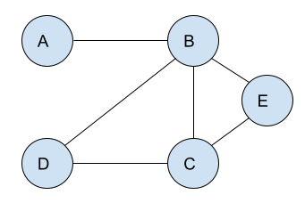

# Graphes

------

Lorsqu'on se balade sur Wikipédia nous remarquons des liens (souvent en bleu) permettant d'aller de page en page, il est possible de lire un texte sur l'histoire de france et d'arriver sur la génétique en seulement deux clics. 

Beaucoup les pages wikipédia sont réliées de cette manière, mais comment pourrions nous représenter ces liens ? (Spoil : Grâce aux graphes)

Les graphes provienent d'une théorie portant leur nom : La théorie des graphes. Celle-ci traitait du **problème des septs ponts de königsberb**

## 1. Introduction

Très utile en mathématiques et en informatique les graphes sont composés de **sommets** (ici A B C D E) et **d'arêtes** (les segments). De plus il existe deux types de graphes, les orientés et non orientés. 

## 1. Graphes non Orientés

Deux sommets *a* et *b* sont adjacents, les sommets *a* et *b* sont reliés par une **arête** *ab*.

On appelle **ordre** d'un graphe **G** le nombre de ses sommets : *ordre = card(S)*.

On appelle **degré d'un sommet S** le __nombre__ de sommets qui lui sont adjacents.

## 2. Graphes Orientés

Un graphe **orienté** est un graphe pour lequel __l'ensemble n'est plus symétrique__. Attention ! Les **arêtes** sont appelées **__arcs__**.

Ainsi on distingue l'arc *(x, y)* de l'arc *(y, x)*.

**L'ordre** ne change pas pour les graphes orientés.

En revanche, on définit pour chaque sommet du graphe :

- son **degré sortant** égal au nombre d'arcs dont __il est la première composante__ ;
- son **degré entrant** égal au nombre d'arcs dont __il est la seconde__.

## 3. Représentation

Un graphe **G** est un couple de (**S**, **A**) :

- **S** est un *ensemble* dont les éléments sont appelés **Sommets** ;
- **A** est une *suite d'éléments* appelés **arêtes**/**arcs** qui sont :
  - des paires d'éléments {*x*, *y*} avec *x* et *y* des sommets de **G**.

## 4. Représentation informatique

Il existe plusieurs façons de représenter un graphe **G = (S, A)** :

- par un ensemble de listes d'adjacences ;
- par une matrice d'adjacences.
- Dictionnaire d'adjacences

### 4. 1. Liste d'adjacence (peu utilisé)

La représentation par listes d'adjacences consiste en :

- un tableau *Adj* de *n* listes (*n* étant le nombre de sommets de **G**) : __une liste__ pour chaque sommet de **S** ;
- pour tout sommet *x* de **S**, *Adj[x]* est __l'ensemble__ des sommets adjacents à *x*.

<u>Avec l'exemple du dessus :</u>

liste_adjacence = [ ['B'], ['A','C','D','E'], ['D','B','E'], ['B','C'], ['B','C'] ]

### 4. 2. Matrice d'adjacence

La représentation par **matrice d'adjacences** consiste en :

- une numérotation des sommets *e* ;
- une matrice *M = ( aij )* où :
    - *aij* = 1 si les sommets de numéros *i* et *j* sont adjacents ;
    - *aij* = 0 sinon.

<u>Avec l'exemple du dessus :</u>

matrice_adjacence = [

[0,1,0,0,0],

[1,0,1,1,1],

[0,1,0,1,1],

[0,1,1,0,0],

[0,1,1,0,0] ]

### 4. 3. Dictionnaire d'adjacence

On peut définir une liste d'adjacences à l'aide d'un **dictionnaire** qui à chaque sommet associe la liste des sommets qui lui sont adjacents.

<u>Avec l'exemple du dessus :</u>

G = {'A' : ('B'), 'B':('A','E','C','D'), 'C' : ('E','D',B'), 'D' : ('B','C'), 'E' : ('B','C')}