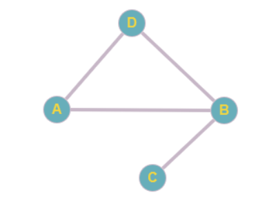
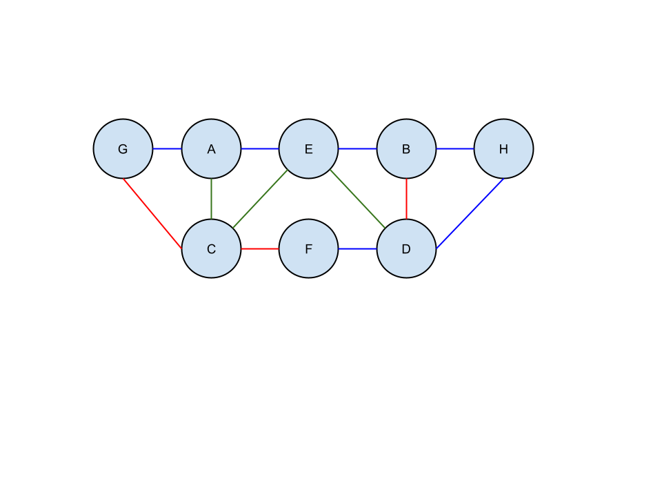

# Protocole de routage TD :

------

## 1. Application de cours :

### 1.  Notion de chemin :

**<u>Commande Traceroute (Tracert avec Windows) :</u>**

La commande Traceroute permet de déterminer le chemin emprunter pour accéder à une adresse donnée. Par exemple : 

1. Essayez la commande `traceroute` (`tracert`avec Windows) avec l'adresse de votre choix. Puis à l'aide d'internet situer les adresse IP empruntées pour accéder à votre site Web.

### 2. Table de routage :

Une table de routage permet d'indiquer pour un routeur `A` les points d'accès à emprunter pour aller à une destination donnée, la métrique peut aussi être indiquée dans certaines tables.

Exemple : 

La table de routage associée au routeur A ici sera :

| Destination | Point d'accès | Métrique |
| ----------- | ------------- | -------- |
| A           | X             | 0        |
| B           | B             | 1        |
| C           | B             | 2        |
| D           | D             | 1        |

1. Dans les fichiers pdf `ELEVE_A`,`ELEVE_B` du dossier `Tables_de_routage`vous retrouverez des tables de routages pour 4 réseaux différents, avec un camarade essayez de retrouver ces réseaux et compléter les tables de routage. Il vous faudra pour cela échanger les informations que chacun possède.

### 3. Protocole RIP :

Le protocole RIP est le protocole qui déterminera le chemin entre deux routeurs, il se base sur le nombre de sauts (métrique) entre ces deux routeurs. Il s'applique sur l'algorithme de [Bellman-Ford](https://fr.wikipedia.org/wiki/Algorithme_de_Bellman-Ford) (Hors programme)

1. Retrouver le plus court chemin entre les Routeurs A et F des réseaux de la partie 2 (Table de routage)

### 4. Protocole OSPF :

Le protocole OSPF lui se base sur les bandes passantes entre chaque routeur, autrement dit leur débit. Il utilise une formule permettant de calculer le coût d'une liaison. On admettra le plus court chemin comme étant le chemin avec le moindre coût.

Calcul du coût : 10**8 / Débit

Exemple : Un débit de 100 b/s => 10\*\*8 / 100 => 10\*\*6 comme coût

<u>Voici un réseau comportant 8 routeurs :</u>

Nous supposerons que pour chaque type connexion le débit est :

- Ethernet (Vert) => 10 Mb/s
- Fast Ethernet  (Bleu) => 1 Gb/s
- Fibre Optique (Rouge) => 10 Gb/s

1. Calculer les coûts de chaque type de connexion à l'aide de la formule ci-dessus.
2. Quelle sera la route optimale entre le routeur G et D? Quelle est son coût ?
3. Quelle sera la route optimale entre le routeur A et D ? Quelle est son coût ?
4. Quelle sera la route optimale entre le routeur A et E ? Quelle est son coût ?
5. Calculer les plus court chemins avec le protocole RIP maintenant et comparer les avec les résultats trouvé pour OSPF

<u>Bonus :</u>

Nous supposerons maintenant que pour chaque type connexion le débit est :

- Ethernet (Bleu) => 10 Mb/s
- Fast Ethernet  (Rouge) => 1 Gb/s
- Fibre Optique (Vert) => 10 Gb/s

Répondre aux questions 1 à 5 de l'exercice précédent avec ces nouveaux type de connexion. 
