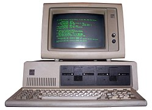
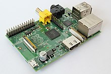

# Circuits intégrés

------

# 1. Rappel de première

## 1.1 Composition d'un ordinateur

Nous avons vu en première que l'évolution de l'architecture d'un ordinateur a abouti à une architecture de Von Neumann.

Cette architecture possède les composants suivants :

- Mémoire
  - Disque dur, SSD (dits 'durs')
  - RAM
- Processeur
- GPU (Carte graphique) (optionnel)
- Périphériques d'entrée
  - Souris / Clavier
- Périphériques de sortie
  - Écran / Son

Tous ces composants sont reliés par des 'bus' (dans le cas d'un ordinateur, il s'agit de câbles).

## 1.2 Évolution de la taille des ordinateurs

- Le premier ordinateur sous l'architecture Von Neumann était l'ENIAC en 1945 et faisait seulement 167 m².

 Image : Wikipédia

- En 1980, l'IBM PC 5150, un peu plus petit.

  Image : Wikipédia

De nos jours, nous utilisons des ordinateurs portables qui sont donc encore plus petits.

## 1.3 Évolution de la puissance des ordinateurs :

**Loi de Moore :**

*Gordon E. Moore fut l’un des trois fondateurs d'Intel (célèbre entreprise d'informatique, encore aujourd’hui)*

La loi de Moore fut établie en 1965. Cette loi a permis d’établir la règle suivante :

- **À coût égal, le nombre de transistors d’un microprocesseur doublera tous les deux ans et ce jusqu’en 2015. (Règle finale en 1975)**

**Pourquoi 2015 ? :**

- Car la miniaturisation des transistors est limitée par la taille des atomes. En effet, après 2015, les scientifiques visaient une taille de 2 nanomètres par transistor (soit 10 atomes) qui en 2018 n'était toujours pas atteinte.

À ce jour, l'un des derniers processeurs en date chez Intel est l'Intel Core i9-12900K, possédant une puce pouvant traiter des données de 64 bits avec des transistors ayant une taille de 10 nanomètres. Le processeur possède 16 cœurs physiques (donc peut effectuer 16 opérations simultanées), contre 1 cœur pour l'Intel 4004.

## 2. Circuits intégrés :

L'évolution des ordinateurs confirme deux points :

- La taille de l'architecture est vouée à être réduite
- La puissance de cette architecture augmente

Afin de satisfaire au mieux le premier point (la taille), des concepteurs se sont concentrés sur la conception d'une carte contenant tous les composants d'un ordinateur sur un seul circuit. C'est ce que l'on appelle un circuit intégré ou en anglais **S**ystem **o**n **C**hip (**SoC**).

Cette carte contient donc de nombreux composants d'ordinateur, comme le processeur, la mémoire, le GPU (partie graphique), la carte son/réseau, etc...

L'architecture ARM se retrouve dans les smartphones notamment, c'est la plus répandue.

La miniaturisation des circuits a permis quelques améliorations par rapport à une architecture traditionnelle :

- Gain de place
- Consomment moins d'énergie

Cependant, ces circuits sont figés, ils ne peuvent être amélioré, ils font donc face à une obsolescence forcée. Le recyclage de ces cartes est en développement mais peine encore à être efficace.

*Image d'une Raspberry PI (Wikipédia)*
